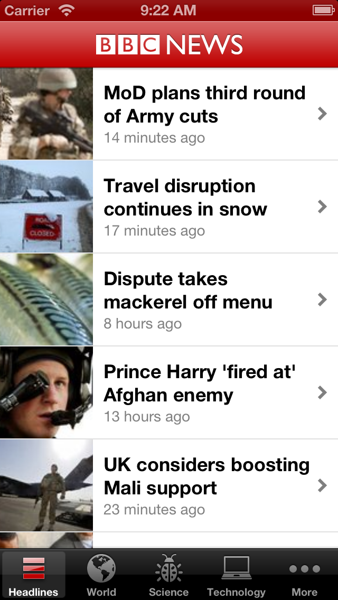
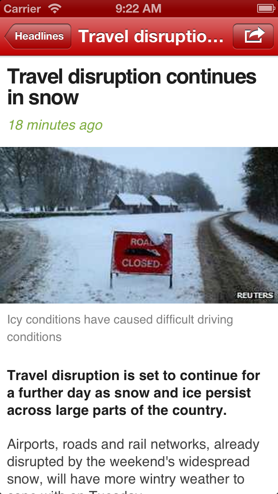
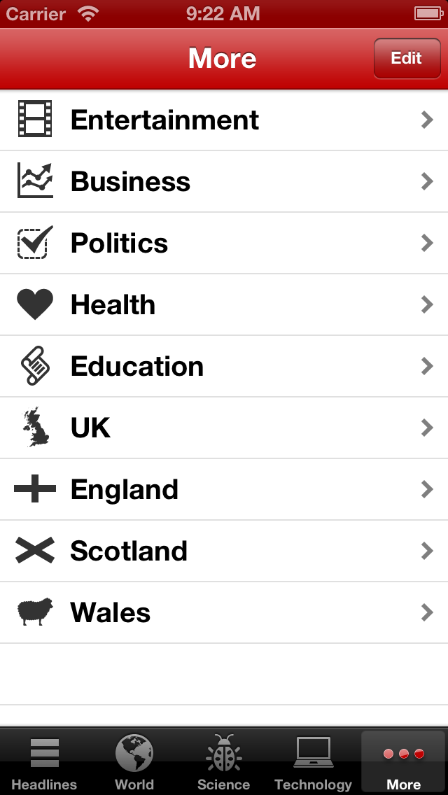

BBC-News-iOS-app
================

A sample iOS app for presenting BBC News stories. It interfaces with my 3rd party [BBC News api](http://api.bbcnews.appengine.co.uk).

- Use of a UITableView
- Use of a UINavigationController
- Use of a UITabBarController
- HTTP requests
- JSON parsing

